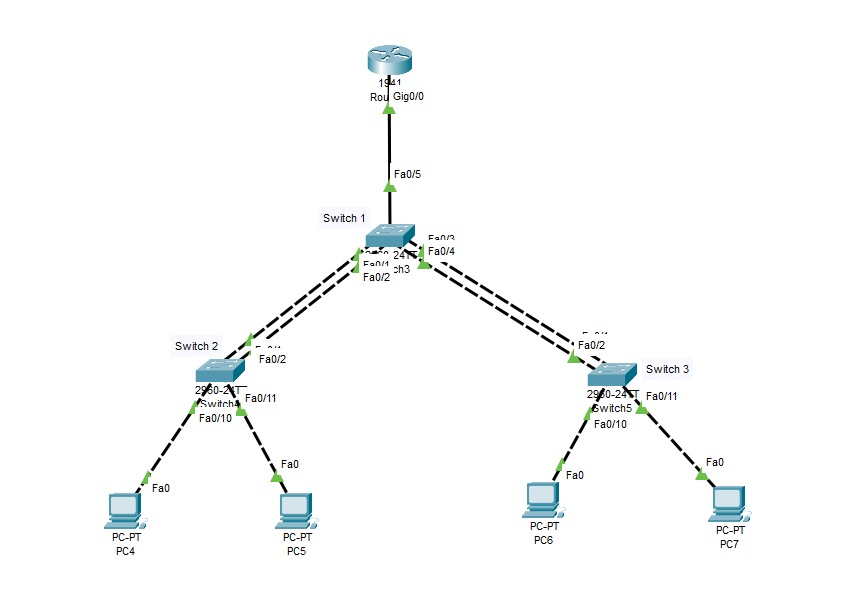
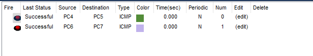

# 🛰️ CCNA Switching Project: Inter-VLAN Routing with EtherChannel and PVST+

## 📘 Project Overview

This project demonstrates a Layer 2 and Layer 3 network implementation using:
- **Router-on-a-Stick** for Inter-VLAN Routing
- **EtherChannel** (Port-Channel) for link aggregation
- **PVST+** (Per-VLAN Spanning Tree Plus) for loop avoidance and redundancy
- **Multiple VLANs** for segmenting network traffic

---

### 🌟 Project Objectives

- Configure multiple physical links between switches to work as a single logical link.
- Implement EtherChannel using LACP (channel-group commands).
- Enable trunking over EtherChannel interfaces.
- Set STP root bridge priority per VLAN for optimized path selection.

---

## 🖧 Topology

---

## 🛠️ Configuration Summary

### 🖥️ Router 0 (Router-on-a-Stick)

<pre>Router(config)#interface gigabitEthernet 0/0.10
Router(config-subif)#encapsulation dot1Q 10
Router(config-subif)#ip address 192.168.10.1 255.255.255.0
Router(config-subif)#no shutdown 
Router(config-subif)#exit

Router(config)#interface gigabitEthernet 0/0.20
Router(config-subif)#encapsulation dot1Q 20
Router(config-subif)#ip address 192.168.20.1 255.255.255.0
Router(config-subif)#no shutdown 
Router(config-subif)#exit

Router(config)#interface gigabitEthernet 0/0
Router(config-if)#no shutdown</pre>

---

### 🔁 Switch 1 (Root for VLAN 10)

<pre>Switch(config)#vlan 10
Switch(config-vlan)#name Accounts
Switch(config-vlan)#exit
Switch(config)#vlan 20
Switch(config-vlan)#name HR
Switch(config-vlan)#exit

Switch(config)#interface range fastEthernet 0/1-2
Switch(config-if-range)#switchport mode trunk
Switch(config-if-range)#channel-group 1 mode active 
Switch(config-if-range)#exit

Switch(config)#interface range fastEthernet 0/3-4
Switch(config-if-range)#switchport mode trunk
Switch(config-if-range)#channel-group 2 mode active 
Switch(config-if-range)#exit

Switch(config)#interface port-channel 1
Switch(config-if)#switchport mode trunk 

Switch(config)#interface port-channel 2
Switch(config-if)#switchport mode trunk 

Switch(config)#spanning-tree vlan 10 priority 4096
Switch(config)#spanning-tree vlan 20 priority 32768

Switch(config)#interface fastEthernet 0/5
Switch(config-if)#switchport mode trunk</pre>

---

### 🔁 Switch 2 (Root for VLAN 20)

<pre>Switch(config)#vlan 10
Switch(config-vlan)#name Accounts
Switch(config-vlan)#exit
Switch(config)#vlan 20
Switch(config-vlan)#name HR
Switch(config-vlan)#exit

Switch(config)#interface range fastEthernet 0/1-2
Switch(config-if-range)#switchport mode trunk 
Switch(config-if-range)#channel-group 1 mode active
Switch(config-if-range)#exit

Switch(config)#interface port-channel 1
Switch(config-if)#switchport mode trunk 
Switch(config-if)#exit

Switch(config)#spanning-tree vlan 10 priority 32768
Switch(config)#spanning-tree vlan 20 priority 4096

Switch(config)#interface fastEthernet 0/10
Switch(config-if)#switchport mode access
Switch(config-if)#switchport access vlan 10
Switch(config-if)#exit

Switch(config)#interface fastEthernet 0/11
Switch(config-if)#switchport mode access
Switch(config-if)#switchport access vlan 10
Switch(config-if)#exit</pre>

---

### 🔁 Switch 3 

<pre>Switch(config)#vlan 10
Switch(config-vlan)#name Accounts
Switch(config-vlan)#exit
Switch(config)#vlan 20
Switch(config-vlan)#name HR
Switch(config-vlan)#exit

Switch(config)#interface range fastEthernet 0/1-2
Switch(config-if-range)#switchport mode trunk 
Switch(config-if-range)#channel-group 2 mode active
Switch(config-if-range)#exit

Switch(config)#interface port-channel 2
Switch(config-if)#switchport mode trunk 
Switch(config-if)#exit

Switch(config)#interface fastEthernet 0/10
Switch(config-if)#switchport mode access
Switch(config-if)#switchport access vlan 20
Switch(config-if)#exit

Switch(config)#interface fastEthernet 0/11
Switch(config-if)#switchport mode access
Switch(config-if)#switchport access vlan 20
Switch(config-if)#exit</pre>

---

### 🧑‍💻 PC Configuration

<pre>PC	IP Address	Subnet Mask	Default Gateway
PC4	192.168.10.2	255.255.255.0	192.168.10.1
PC5	192.168.10.3	255.255.255.0	192.168.10.1
PC6	192.168.20.2	255.255.255.0	192.168.20.1
PC7	192.168.20.3	255.255.255.0	192.168.20.1</pre>

---

### ✅ Verification
### ✅ Intra-VLAN Connectivity:

<pre>PC4 <-> PC5 (VLAN 10)

PC6 <-> PC7 (VLAN 20)</pre>

---

### ✅ Inter-VLAN Routing (via Router):

<pre>PC4 <-> PC6

PC4 <-> PC7</pre>

---

### 📂 Folder Structure

Inter-VLAN Routing with EtherChannel and PVST+/

    ├── 01-Topology.png
    ├── 02-Inter-Vlan-Routing.png
    ├── 03-Same-Vlan-Connectivity.png
    └── README.md

