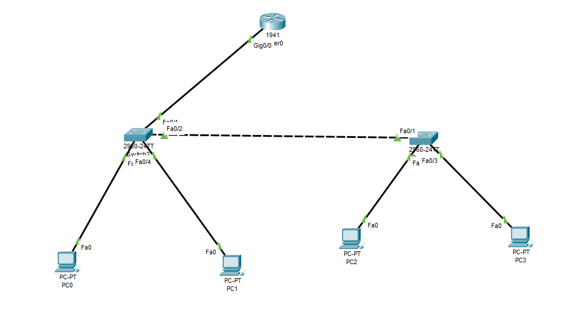
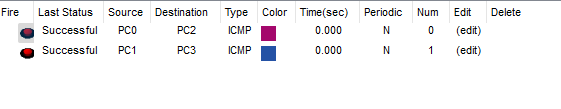
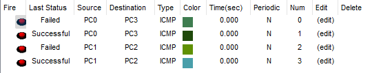

# 📘 Inter-VLAN Routing using Router-on-a-Stick

This project demonstrates how to configure Inter-VLAN Routing using a **Router-on-a-Stick** setup with two switches, one router, and four PCs. Each VLAN has its own subnet and uses router sub-interfaces to enable communication between VLANs.

---

### ### 🌟 Project Objectives

- Implement Inter-VLAN routing using a single physical router interface.
- Configure subinterfaces with 802.1Q encapsulation for each VLAN.
- Create VLANs and assign switch ports appropriately.
- Use trunking between switch and router to carry multiple VLAN traffic.
- Verify both Intra-VLAN and Inter-VLAN communication.

---

## 🖥️ Topology

---

## 🔧 Configuration Steps

### 🔹 Switch 0 Configuration

<pre>Switch(config)# vlan 10
Switch(config-vlan)# name Sales
Switch(config)# vlan 20
Switch(config-vlan)# name HR

Switch(config)# interface fastEthernet 0/3
Switch(config-if)# switchport mode access
Switch(config-if)# switchport access vlan 10

Switch(config)# interface fastEthernet 0/4
Switch(config-if)# switchport mode access
Switch(config-if)# switchport access vlan 20

Switch(config)# interface fastEthernet 0/1
Switch(config-if)# switchport mode trunk
Switch(config-if)# switchport trunk allowed vlan 10,20
Switch(config-if)# no shutdown

Switch(config)# interface fastEthernet 0/2
Switch(config-if)# switchport mode trunk
Switch(config-if)# switchport trunk allowed vlan 10,20
Switch(config-if)# no shutdown</pre>

---

###🔹 Switch 1 Configuration

<pre>Switch(config)# vlan 10
Switch(config-vlan)# name Sales
Switch(config)# vlan 20
Switch(config-vlan)# name HR

Switch(config)# interface fastEthernet 0/2
Switch(config-if)# switchport mode access
Switch(config-if)# switchport access vlan 10

Switch(config)# interface fastEthernet 0/3
Switch(config-if)# switchport mode access
Switch(config-if)# switchport access vlan 20

Switch(config)# interface fastEthernet 0/1
Switch(config-if)# switchport mode trunk
Switch(config-if)# switchport trunk allowed vlan 10,20
Switch(config-if)# no shutdown</pre>

---

###🔹 Router 0 Configuration (Router-on-a-Stick)

<pre>Router(config)# interface gigabitEthernet 0/0.10
Router(config-subif)# encapsulation dot1Q 10
Router(config-subif)# ip address 192.168.10.1 255.255.255.0
Router(config-subif)# no shutdown
Router(config-subif)# exit

Router(config)# interface gigabitEthernet 0/0.20
Router(config-subif)# encapsulation dot1Q 20
Router(config-subif)# ip address 192.168.20.1 255.255.255.0
Router(config-subif)# no shutdown
Router(config-subif)# exit

Router(config)# interface gigabitEthernet 0/0
Router(config-if)# no shutdown</pre>

---

### 🧪 IP Addressing Table

<pre>Device	VLAN	IP Address	Subnet Mask	Default Gateway
PC0	10	192.168.10.10	255.255.255.0	192.168.10.1
PC1	20	192.168.20.10	255.255.255.0	192.168.20.1
PC2	10	192.168.10.11	255.255.255.0	192.168.10.1
PC3	20	192.168.20.11	255.255.255.0	192.168.20.1</pre>

---

### ✅ Testing

#### Verify connectivity within the same VLAN:

<pre>PC0 ↔ PC2

PC1 ↔ PC4</pre>

#### Verify Inter-VLAN Routing via Router:

<pre>PC0 ↔ PC3

PC1 ↔ PC2</pre>

---

### 📂 Folder Structure

Inter-VLAN-Routing-Router-on-a-Stick/

    ├── 01-Topology.png
    ├── 02-Different-Vlan.png
    ├── 03-Same-Vlan.png
    └── README.md
