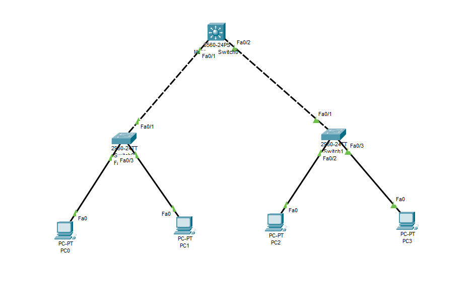
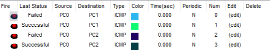

# 🔧  CCNA Switching Project: L3-SWITCH-VLAN-DHCP-PORT-SECURITY

This switching practical demonstrating Layer 3 Switch Inter-VLAN Routing, DHCP Configuration, and Port Security implementation.

---

### 📊 Topology 

---

### 🌟 Project Objectives

- Enable Inter-VLAN Routing on a Layer 3 Switch
- Assign IP addresses dynamically using DHCP for each VLAN
- Secure access ports using Port Security with sticky MACs
- Verify both intra-VLAN and inter-VLAN connectivity

---

### 🔹 Step 1: VLAN Interface and Routing on L3 Switch

<pre>Switch(config)#interface vlan 10
Switch(config-if)#ip address 10.0.10.1 255.255.255.0
Switch(config-if)#no shutdown 
Switch(config-if)#exit

Switch(config)#interface vlan 20
Switch(config-if)#ip address 10.0.20.1 255.255.255.0
Switch(config-if)#no shutdown 
Switch(config-if)#exit

Switch(config)#interface vlan 30
Switch(config-if)#ip address 10.0.30.1 255.255.255.0
Switch(config-if)#no shutdown 
Switch(config-if)#exit</pre>

---

### 🔹 Step 2: Configure DHCP Pools on L3 Switch

<pre>Switch(config)#ip dhcp pool vlan10
Switch(dhcp-config)#network 10.0.10.0 255.255.255.0
Switch(dhcp-config)#default-router 10.0.10.1
Switch(dhcp-config)#exit

Switch(config)#ip dhcp pool vlan20
Switch(dhcp-config)#network 10.0.20.0 255.255.255.0
Switch(dhcp-config)#default-router 10.0.20.1
Switch(dhcp-config)#exit

Switch(config)#ip dhcp pool vlan30
Switch(dhcp-config)#network 10.0.30.0 255.255.255.0
Switch(dhcp-config)#default-router 10.0.30.1
Switch(dhcp-config)#exit</pre>

---

### 🔹 Step 3: Trunk Links from L3 Switch to L2 Switches

<pre>Switch(config)#interface fastEthernet 0/1
Switch(config-if)#switchport trunk encapsulation dot1q
Switch(config-if)#switchport mode trunk 

Switch(config)#interface fastEthernet 0/2
Switch(config-if)#switchport trunk encapsulation dot1q
Switch(config-if)#switchport mode trunk </pre>

---

###🛠️ L2 Switch Configuration (Switch0 & Switch1)

### Switch 0

<pre>Switch(config)#interface fastEthernet 0/2
Switch(config-if)#switchport mode access 
Switch(config-if)#switchport access vlan 10

Switch(config)#interface fastEthernet 0/3
Switch(config-if)#switchport mode access 
Switch(config-if)#switchport access vlan 20

Switch(config)#interface fastEthernet 0/2
Switch(config-if)#switchport mode access 
Switch(config-if)#switchport access vlan 10
Switch(config-if)#switchport port-security
Switch(config-if)#switchport port-security maximum 1
Switch(config-if)#switchport port-security violation shutdown
Switch(config-if)#switchport port-security mac-address sticky 
Switch(config-if)#exit

Switch(config)#interface fastEthernet 0/3
Switch(config-if)#switchport mode access 
Switch(config-if)#switchport access vlan 20
Switch(config-if)#switchport port-security
Switch(config-if)#switchport port-security maximum 1
Switch(config-if)#switchport port-security violation shutdown
Switch(config-if)#switchport port-security mac-address sticky 
Switch(config-if)#exit

Switch(config)#interface fastEthernet 0/1
Switch(config-if)#switchport mode trunk</pre>

---

### Switch 1

<pre>Switch(config)#interface fastEthernet 0/2
Switch(config-if)#switchport mode access 
Switch(config-if)#switchport access vlan 30

Switch(config)#interface fastEthernet 0/3
Switch(config-if)#switchport mode access 
Switch(config-if)#switchport access vlan 10

Switch(config)#interface fastEthernet 0/2
Switch(config-if)#switchport mode access 
Switch(config-if)#switchport access vlan 30
Switch(config-if)#switchport port-security
Switch(config-if)#switchport port-security maximum 1
Switch(config-if)#switchport port-security violation shutdown
Switch(config-if)#switchport port-security mac-address sticky 
Switch(config-if)#exit

Switch(config)#interface fastEthernet 0/3
Switch(config-if)#switchport mode access 
Switch(config-if)#switchport access vlan 10
Switch(config-if)#switchport port-security
Switch(config-if)#switchport port-security maximum 1
Switch(config-if)#switchport port-security violation shutdown
Switch(config-if)#switchport port-security mac-address sticky 
Switch(config-if)#exit

Switch(config)#interface fastEthernet 0/1
Switch(config-if)#switchport mode trunk</pre>

---

### 🧑‍💻 PC IP Addressing ( via DHCP )

<pre>PC	IP Address	Subnet Mask	Default Gateway
PC0	10.0.10.2	255.255.255.0	10.0.10.1
PC1	10.0.20.2	255.255.255.0	10.0.20.1
PC2	10.0.30.2	255.255.255.0	10.0.30.1
PC3	10.0.10.3	255.255.255.0	10.0.10.1</pre>

---

### ✅ Verification

✔️ Intra-VLAN Connectivity

PC0 ↔ PC3 (VLAN 10)

✔️ Inter-VLAN Connectivity (L3 Routing)

PC0 ↔ PC1

PC0 ↔ PC2

---

### 📂 Folder Structure

L3-SWITCH-VLAN-DHCP-PORT-SECURITY/

    ├── 01-Topology.png
    ├── 02-Same-Vlan.png
    ├── 03-Different-Vlan.png
    └── README.md
